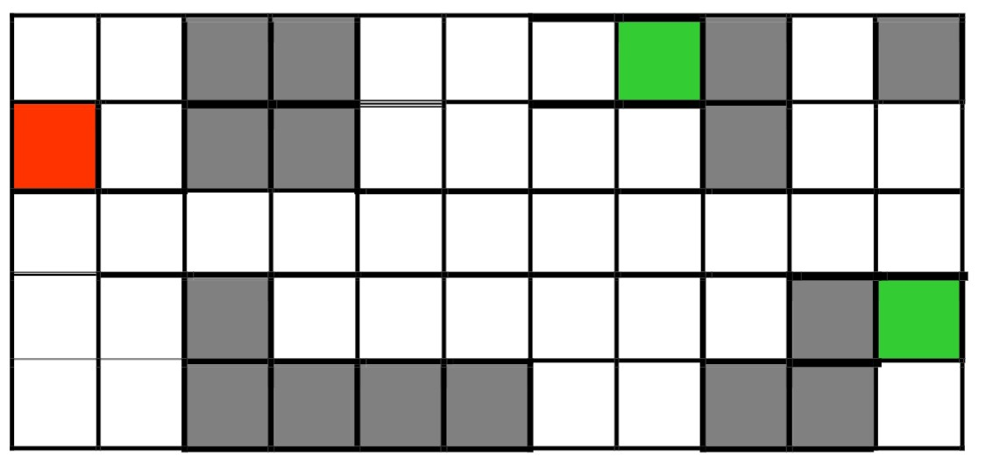
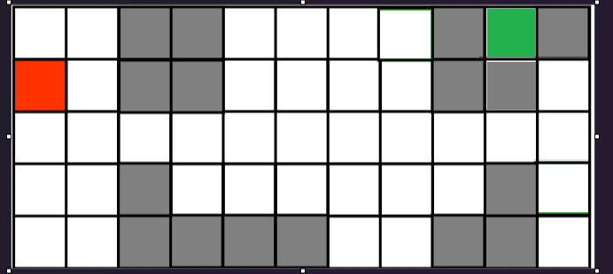
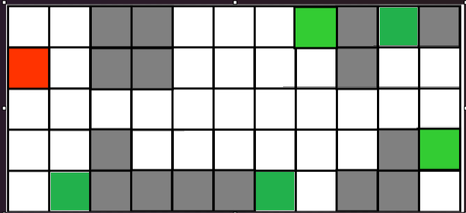

# Robot Maze Navigation

## Introduction 
This project was implement a tree based search algorithm from scratch and create different heuristic search (informed and uninformed types).

## Assignment Problem 

In the lectures you have seen the Robot Navigation problem: The environment is an NxM grid (where N > 1  and M > 1) with a number of walls occupying some cells (marked as grey cells). The robot is initially located in one of the empty cells (marked as a red cell) and required to find a path to  visit one of the designated cells of the grid  (marked as green cells). For instance, the following is one possible environment

Main visualisation of the maze: 

### Problem's File Format
# Problem's File Format

The problems are stored in simple text files with the following format:

- First line contains a pair of numbers [N,M] – the number of rows and the number of columns of the grid, enclosed in square brackets.
- Second line contains a pair of numbers (x1,y1)– the coordinates of the current location of the agent, the initial state.
- Third line contains a sequence of pairs of numbers separated by |; these are the coordinates of the goal states: (xG1,yG1) | (xG2,yG2) | ... | (xGn,yGn), where n ≥ 1. 
- The subsequent lines represent the locations of the walls: The tuple (x,y,w,h) indicates that the leftmost top corner of the wall occupies cell (x,y) with a width of w cells and a height of h cells.
- We are only interested in search algorithms. Therefore, it can be assumed that the problem files will contain valid configurations. For instance, if N=5 and M = 11 then you don't have to worry that the agent is initially located at coordinates (15, 3).

**NOTE:** The objective is to reach one of the green cells.

**Following Script:**

[5,11] // The grid has 5 rows and 11 columns

(0,1) // initial state of the agent – coordinates of the red cell

(7,0) | (10,3) // goal states for the agent – coordinates of the green cells

(2,0,2,2) // the square wall has the leftmost top corner occupies cell (2,0) and is 2 cells wide and 2 cell high

(8,0,1,2)

(10,0,1,1)

(2,3,1,2)

(3,4,3,1)

(9,3,1,1)

(8,4,2,1)

## Uninformed

- Depth-First Search 
  -  Select one option, try it, go back when there are no more options.
- Breadth-First Search 
  - Expand all options one level at a time.

## Informed

- GBFS
  - Greedy Best-First Use only the cost to reach the goal from the current node to evaluate the node.

- A\* ("A Star")
  - Use both the cost to reach the goal from the current node and

the cost to reach this node to evaluate the node.

- Custom
  - Your search strategy 1 An uninformed method to find a path to reach the goal.
  - Your search strategy 2 An informed method to find a shortest path (with least moves) to reach the goal.

 Maze in unreachable form: 

Maze in multi goal form: 

